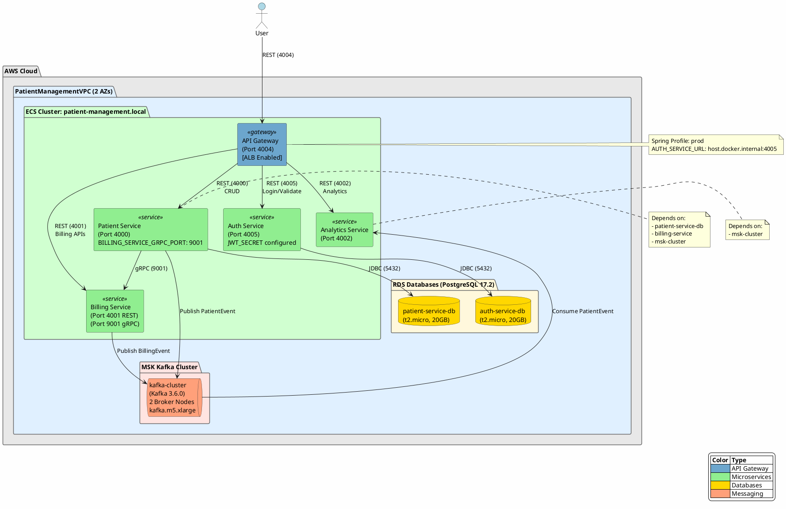
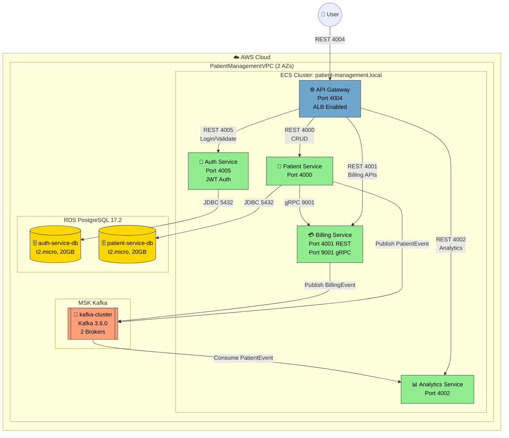

# Microservices Patient Management Application

## Architecture Diagram
# diagram



```plantuml
actor User
User -> API_Gateway: HTTP Request
API_Gateway -> Auth_Service: Auth/Token Validation
API_Gateway -> Patient_Service: Patient CRUD
Patient_Service -> Billing_Service: Billing APIs GRPC


Patient_Service -> Kafka: Publish Patient Events
Billing_Service -> Kafka: Publish Billing Events
Analytics_Service -> Kafka: Consume Patient Events

API_Gateway -[hidden]-> Kafka
Auth_Service -[hidden]-> Kafka

database DB1 as PatientDB
database DB2 as BillingDB
Patient_Service --> PatientDB
Auth_Service --> BillingDB
@enduml
```

### Mermaid Diagram (GitHub Native Support)



## Overview
This project is a modular microservices-based system for managing patients, billing, analytics, authentication, and API gateway. Each service is independently deployable and communicates via REST, gRPC, or Kafka events.

## Architecture
- **api-gateway**: Routes and secures all client requests to backend services.
- **auth-services**: Handles authentication, token generation, and validation.
- **patient-service**: Manages CRUD operations for patient records and emits events for downstream processing.
- **billing-service**: Manages billing accounts and transactions, supporting both REST and gRPC/event-driven communication.
- **analytics-service**: Consumes patient events from Kafka and logs analytics data.
- **infrastructure**: Scripts and configuration for local/cloud deployment and environment setup.
- **integration-tests**: Contains integration and end-to-end tests for the entire system.

## Key Technologies
- Java (Spring Boot)
- Kafka (event-driven communication)
- gRPC (Protobuf-based inter-service communication)
- Docker (containerization)
- Maven (build and dependency management)

## Getting Started
1. Clone the repository.
2. Build all modules: `./mvnw clean install`
3. Start required infrastructure (e.g., Kafka, databases, LocalStack).
4. Run each service using Docker or `java -jar target/*.jar`.
5. Use the provided HTTP/gRPC request samples for testing.

## Module Documentation
Each module contains a README.md with detailed design, API/event processing, and flow descriptions.

## Contribution
- Follow Java and Maven best practices.
- Document new modules or changes in the respective README.md.

---

For more details, see the README.md inside each module folder.
der.
