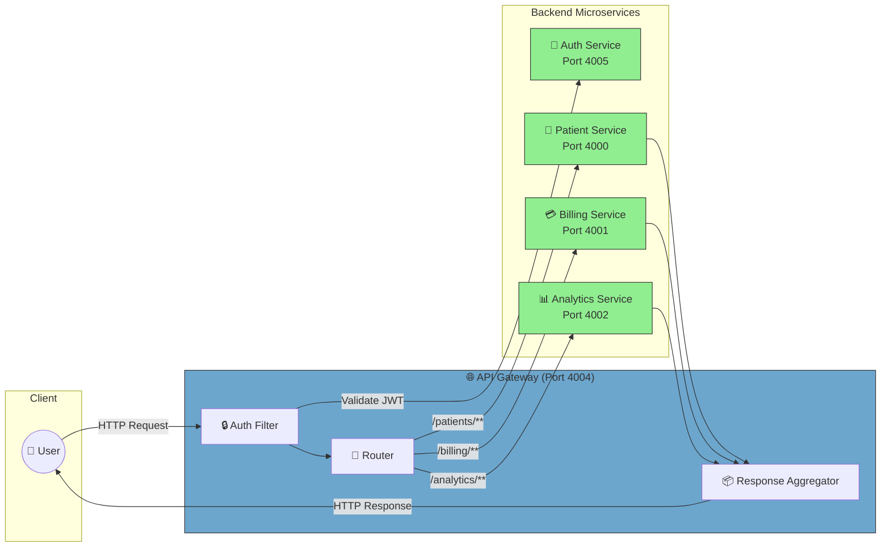

# API Gateway Documentation

## Overview
The API Gateway acts as the single entry point for all client requests, routing them to the appropriate microservice. It is built using Spring Boot and typically uses Spring Cloud Gateway or Zuul for routing and filtering.

## Code Design & Request Flow
- **Routing:**
	- Defines routes to backend microservices (patient, billing, analytics, auth) in configuration or Java code.
	- Applies filters for authentication, logging, and request transformation.
- **API Processing:**
	- Receives HTTP requests from clients.
	- Validates and authenticates requests (often via JWT or OAuth2).
	- Forwards requests to the correct microservice based on path or headers.
	- Aggregates responses if needed and returns to the client.
- **Configuration:**
	- Routing and filter rules are set in `application.properties` or Java config classes.

## Request Handling Flow
1. **Client Request:**
		- Client sends HTTP request to the gateway.
2. **Pre-processing:**
		- Authentication and logging filters are applied.
3. **Routing:**
		- Request is routed to the appropriate microservice.
4. **Response Aggregation:**
		- (Optional) Gateway aggregates responses from multiple services.
5. **Response to Client:**
		- Gateway returns the final response to the client.

## Architecture Diagram

## Source Structure
- `src/main/java/`: Gateway logic, routing, and filters.
- `src/main/resources/`: Configuration files (`application.properties`).
- `src/test/java/`: Unit and integration tests.

## Key Files
- `Dockerfile`: Containerization setup
- `pom.xml`: Maven configuration

## How to Run
1. Build: `./mvnw clean install`
2. Run: `java -jar target/*.jar` or use Docker

## Notes
- Update `application.properties` for custom routes or security settings.
