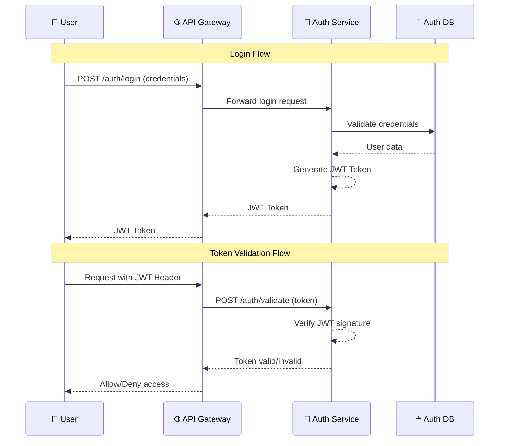
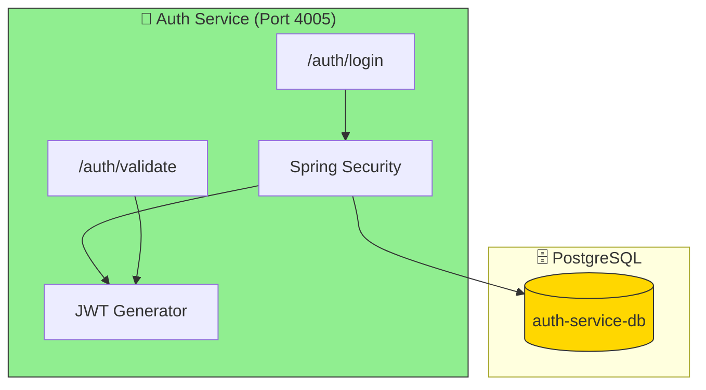

# Auth Services Documentation

## Overview
The Auth Service manages authentication and authorization for the application, including token generation and validation. It is built using Spring Boot and Spring Security.

## Code Design & Authentication Flow
- **Authentication:**
	- Exposes REST endpoints for login and token validation (e.g., `/auth/login`, `/auth/validate`).
	- Validates user credentials against a user store (database or in-memory).
	- Generates JWT or similar tokens upon successful authentication.
- **Authorization:**
	- Validates tokens on protected endpoints.
	- Integrates with the API Gateway and other services for secure access.
- **Configuration:**
	- Security settings and secrets are set in `application.properties`.

## Request Handling Flow
1. **Login Request:**
		- Client sends credentials to `/auth/login`.
2. **Credential Validation:**
		- Service checks credentials and, if valid, generates a token.
3. **Token Usage:**
		- Client uses token for subsequent requests to protected endpoints.
4. **Token Validation:**
		- `/auth/validate` endpoint checks token validity for other services.

## Authentication Flow Diagram

## Source Structure
- `src/main/java/`: Controllers, authentication logic, and security config.
- `src/main/resources/`: Service configuration (`application.properties`).
- `src/test/java/`: Test cases for authentication flows.

## Key Files
- `Dockerfile`: Containerization setup
- `pom.xml`: Maven configuration

## How to Run
1. Build: `./mvnw clean install`
2. Run: `java -jar target/*.jar` or use Docker

## Notes
- Configure authentication providers and secrets in `application.properties`.
