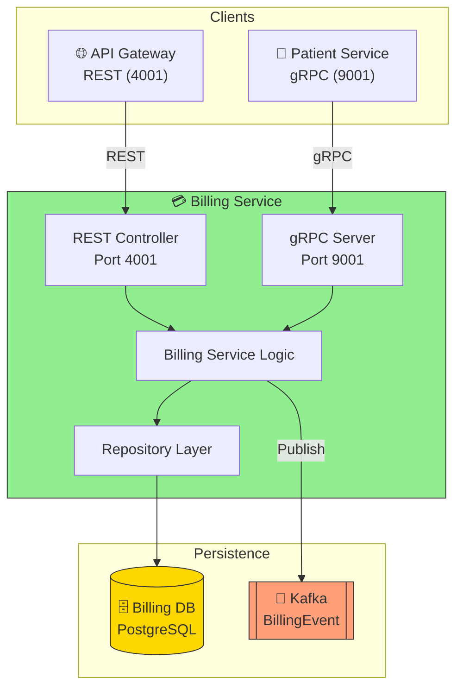
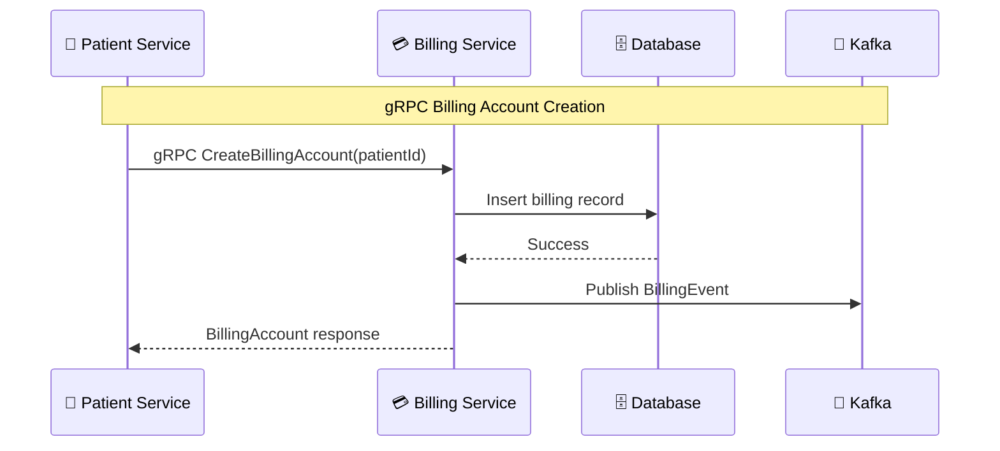

# Billing Service Documentation

## Overview
The Billing Service manages billing accounts and transactions, and communicates with other services via REST and gRPC. It is built using Spring Boot and supports both synchronous (HTTP) and asynchronous (gRPC/event) operations.

## Code Design & Processing Flow
- **REST APIs:**
	- Exposes endpoints for creating, updating, and retrieving billing accounts and transactions.
	- Validates incoming requests and interacts with the database for persistence.
- **gRPC/Event Processing:**
	- Defines Protobuf schemas in `src/main/proto/` for inter-service communication.
	- Consumes or produces events for billing-related actions (e.g., account creation, payment processed).
- **Business Logic:**
	- Service classes handle billing calculations, validation, and persistence.
- **Configuration:**
	- Service and gRPC settings are set in `application.properties`.

## Request/Event Handling Flow
1. **API Request:**
		- Client or another service sends a REST/gRPC request to the billing service.
2. **Validation & Processing:**
		- Service validates input, processes business logic, and updates the database.
3. **Event Emission (if applicable):**
		- Emits billing events to Kafka or gRPC consumers.
4. **Response:**
		- Returns result or status to the caller.

## Service Architecture Diagram

## Source Structure
- `src/main/java/`: Controllers, service classes, and gRPC/event logic.
- `src/main/resources/`: Configuration files (`application.properties`).
- `src/main/proto/`: Protobuf definitions for gRPC/event schema.
- `src/test/java/`: Test cases for billing logic.

## Key Files
- `Dockerfile`: Containerization setup
- `pom.xml`: Maven configuration

## How to Run
1. Build: `./mvnw clean install`
2. Run: `java -jar target/*.jar` or use Docker

## Notes
- Update Protobuf files in `src/main/proto/` for API/event schema changes.
