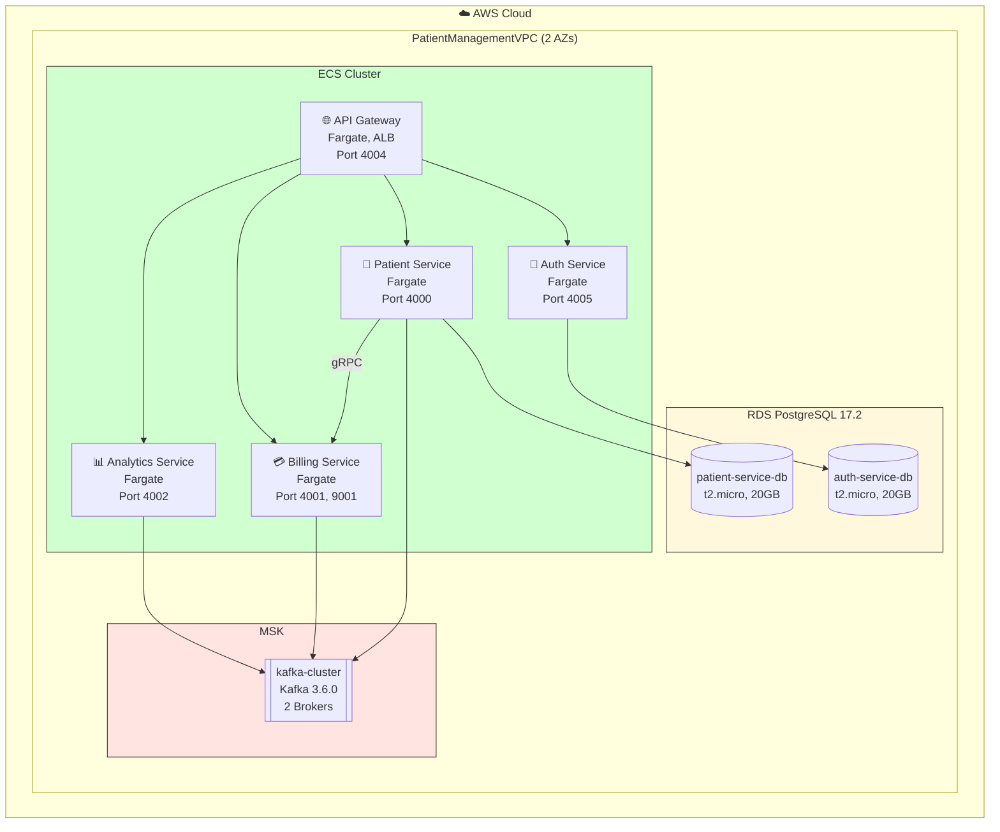
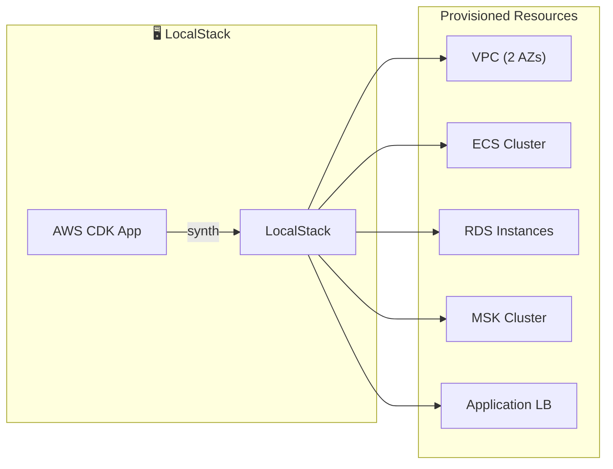

# Infrastructure Module Documentation

## Overview
The Infrastructure module contains scripts and configuration for deploying and managing the microservices environment, both locally and in the cloud.

## Code Design & Deployment Flow
- **Deployment Scripts:**
	- `localstack-deploy.sh` automates local environment setup using LocalStack for AWS service emulation.
- **Configuration:**
	- Java code (if present) supports infrastructure automation or integration.
	- Resource and environment settings are managed in `src/main/resources/`.
- **Testing:**
	- Test utilities for infrastructure code are in `src/test/java/`.

## Deployment Process
1. **Local Deployment:**
		- Run `localstack-deploy.sh` to start local AWS-like services.
2. **Cloud Deployment:**
		- Use provided scripts or CI/CD pipelines for cloud setup.
3. **Configuration:**
		- Adjust environment variables and resource files as needed.

## Infrastructure Architecture Diagram

## Source Structure
- `src/main/java/`: Infrastructure automation logic (if present).
- `src/main/resources/`: Configuration files.
- `src/test/java/`: Test cases for infrastructure utilities.

## Key Files
- `localstack-deploy.sh`: Local deployment script
- `pom.xml`: Maven configuration

## How to Use
- Run scripts in the root of this module for local/cloud setup.
- Build with Maven if Java code is present.
