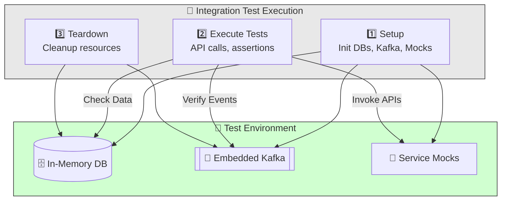
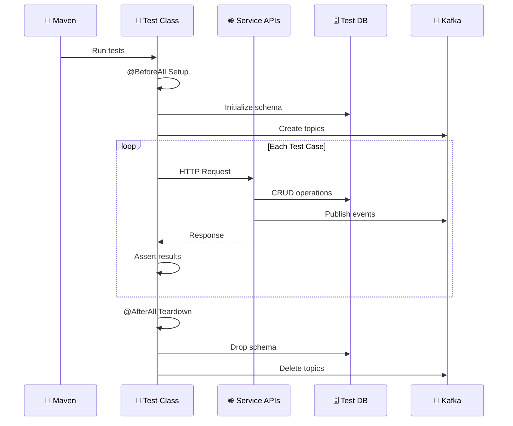

# Integration Tests Documentation

## Overview
This module contains integration and end-to-end tests for the microservices application, ensuring that all services work together as expected.

## Code Design & Test Flow
- **Test Cases:**
	- Located in `src/test/java/`, covering cross-service scenarios and workflows.
	- Tests may use mock servers, embedded Kafka, or in-memory databases for isolation.
- **Execution:**
	- Tests are run using Maven's test lifecycle.
	- Results are reported in the console and as test reports.

## Test Execution Flow
1. **Setup:**
		- Test environment is initialized (databases, Kafka, etc.).
2. **Test Execution:**
		- Integration tests are run, invoking APIs and verifying inter-service behavior.
3. **Teardown:**
		- Resources are cleaned up after tests.

## Test Flow Diagram





## Source Structure
- `src/test/java/`: Integration and end-to-end test cases.

## Key Files
- `pom.xml`: Maven configuration

## How to Run
Use Maven to run the integration tests:

```sh
./mvnw test
```
