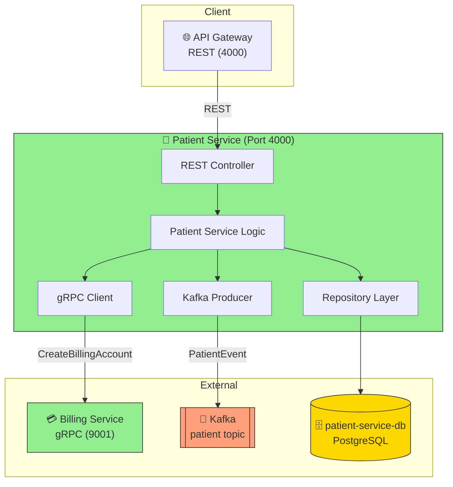
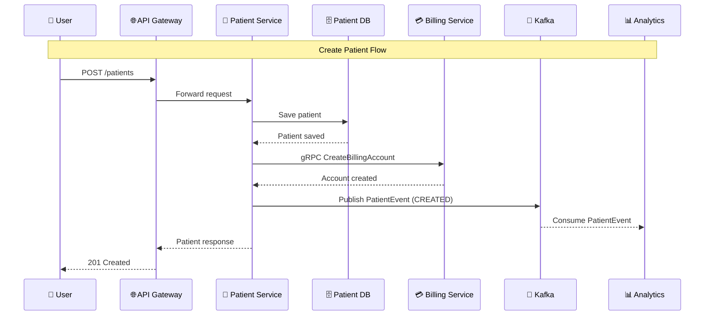

# Patient Service Documentation

## Overview
The Patient Service manages CRUD operations for patient records and emits events for downstream processing. It is built using Spring Boot and supports both REST APIs and event-driven communication (Kafka/gRPC).

## Code Design & Processing Flow
- **REST APIs:**
	- Exposes endpoints for creating, reading, updating, and deleting patient records.
	- Validates requests and interacts with the database for persistence.
- **Event Processing:**
	- Emits patient events (e.g., created, updated, deleted) to Kafka or via gRPC.
	- Protobuf schemas for events are defined in `src/main/proto/`.
- **Business Logic:**
	- Service classes handle validation, persistence, and event emission.
- **Configuration:**
	- Service and event settings are set in `application.properties`.

## Request/Event Handling Flow
1. **API Request:**
		- Client or another service sends a REST request to the patient service.
2. **Validation & Processing:**
		- Service validates input, processes business logic, and updates the database.
3. **Event Emission:**
		- Emits patient events to Kafka or gRPC consumers for analytics, billing, etc.
4. **Response:**
		- Returns result or status to the caller.

## Service Architecture Diagram

## Source Structure
- `src/main/java/`: Controllers, service classes, and event logic.
- `src/main/resources/`: Configuration files (`application.properties`, `data.sql`).
- `src/main/proto/`: Protobuf definitions for event schema.
- `src/test/java/`: Test cases for patient logic.

## Key Files
- `Dockerfile`: Containerization setup
- `pom.xml`: Maven configuration

## How to Run
1. Build: `./mvnw clean install`
2. Run: `java -jar target/*.jar` or use Docker

## Notes
- Update Protobuf files in `src/main/proto/` for event schema changes.
- Seed data can be managed in `src/main/resources/data.sql`.
